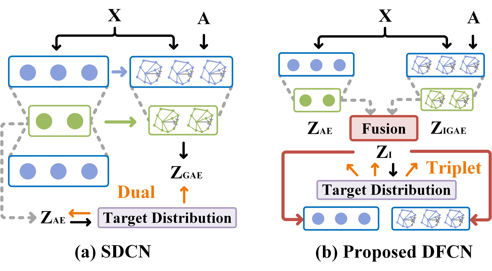

## DFCN
<span id="jump1"></span>
<br/>


###  [Paper](https://arxiv.org/pdf/2012.09600.pdf)

Deep Fusion Clustering Network.<br>

[Wenxuan Tu](https://github.com/WxTu/DFCN/), Sihang Zhou, Xinwang Liu, Xifeng Guo, Zhiping Cai, En zhu, Jieren Cheng.<br>

Accepted by AAAI2021.<br>

### [License](https://raw.githubusercontent.com/nvlabs/SPADE/master/LICENSE.md)

All rights reserved.
Licensed under the [Apache License 2.0](http://www.apache.org/licenses/LICENSE-2.0). 

The code is released for academic research use only. For commercial use, please contact [wenxuantu@163.com].


## Installation

Clone this repo.
```bash
git clone https://github.com/WxTu/DFCN.git
```

* Windows or Linux
* Python3
* [Pytorch(1.2+)](https://pytorch.org/)
* Numpy
* Sklearn
* Torchvision
* Matplotlib


## Preparation

We adopt six datasets in total, including three graph datasets (ACM, DBLP, and CITE) and three non-graph datasets (USPS, HHAR, and REUT). To train a model on these datasets, download datasets from [Baidu Cloud](https://pan.baidu.com/s/1qmKGpQbzdq-DBYmgmqC_0A) (access code: 6p37) or [SDCN](https://github.com/bdy9527/SDCN).

## Code Structure
- `load_data.py`: processes the dataset before passing to the network.
- `DFCN.py`: defines the architecture of the whole network.
- `IGAE.py`: defines the improved graph autoencoder.
- `AE.py`: defines the autoencoder.
- `opt.py`: defines some hyper-parameters.
- `utils.py`: defines the lr-policy, metrics, and others.
- `Train.py`: the entry point for training and testing.
- `main.py`: you could run it directly.

<span id="jump2"></span>

## Visualization


## Contact
[wenxuantu@163.com](wenxuantu@163.com)

Any discussions or concerns are welcomed!

## Citation
If you use this code for your research, please cite our papers.
```
@inproceedings{TuDeep,
  title={Deep Fusion Clustering Network},
  author={Wenxuan Tu, Sihang Zhou, Xinwang Liu, Xifeng Guo, Zhiping Cai, En zhu, Jieren Cheng},
  booktitle={https://arxiv.org/abs/2012.09600},
  year={2020}
}
```
## Acknowledgement

D. Bo, X. Wang, C. Shi, et al. Structural Deep Clustering Network. In WWW, 2020.<br/> 
--[https://github.com/bdy9527/SDCN](https://github.com/bdy9527/SDCN)

J. Xie, R. Girshick, and A. Farhadi. Unsupervised Deep Embedding for Clustering Analysis. In ICML, 2016.<br/>
--[https://github.com/vlukiyanov/pt-dec](https://github.com/vlukiyanov/pt-dec)

X. Guo, L. Gao, X. Liu, et al. Improved Deep Embedded Clustering with Local Structure Preservation. In IJCAI, 2017.<br/>
--[https://github.com/XifengGuo/IDEC](https://github.com/XifengGuo/IDEC)

