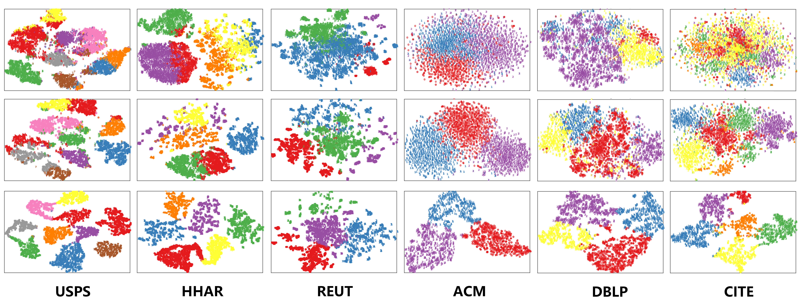

[python-img]: https://img.shields.io/github/languages/top/WxTu/DFCN?color=lightgrey
[stars-img]: https://img.shields.io/github/stars/WxTu/DFCN?color=yellow
[stars-url]: https://github.com/WxTu/DFCN/stargazers
[fork-img]: https://img.shields.io/github/forks/WxTu/DFCN?color=lightblue&label=fork
[fork-url]: https://github.com/WxTu/DFCN/network/members
[visitors-img]: https://visitor-badge.glitch.me/badge?page_id=WxTu/DFCN
[adgc-url]: https://github.com/WxTu/DFCN


## Paper
[![Made with Python][python-img]][adgc-url]
[![GitHub stars][stars-img]][stars-url]
[![GitHub forks][fork-img]][fork-url]
[![visitors][visitors-img]][adgc-url]

Source code for the paper "Deep Fusion Clustering Network"<br>

W. Tu, S. Zhou, X. Liu, X. Guo, Z. Cai, E. Zhu, and J. Cheng.<br>

Accepted by AAAI2021. [[Paper]](https://arxiv.org/pdf/2012.09600.pdf) [[Poster]](./figure/DFCN_Poster.pdf) <br>


## Installation

Clone this repo.
```bash
git clone https://github.com/WxTu/DFCN.git
```

* Windows 10 or Linux 18.04
* Python 3.7.5
* [Pytorch (1.2.0+)](https://pytorch.org/)
* Numpy 1.18.0
* Sklearn 0.21.3
* Torchvision 0.3.0
* Matplotlib 3.2.1


## Preparation

We adopt six datasets in total, including three graph datasets (ACM, DBLP, and CITE) and three non-graph datasets (USPS, HHAR, and REUT). To train a model on these datasets, please download them from [Baidu Cloud](https://pan.baidu.com/s/1ykIPGLXLMtMqtgpXOq3_sQ) (access code: 4622) or [SDCN](https://github.com/bdy9527/SDCN).

## Code Structure & Usage

Here we provide an implementation of Deep Fusion Clustering Network (DFCN) in PyTorch, along with an execution example on the DBLP dataset (due to file size limit). The repository is organised as follows:

- `load_data.py`: processes the dataset before passing to the network.
- `DFCN.py`: defines the architecture of the whole network.
- `IGAE.py`: defines the improved graph autoencoder.
- `AE.py`: defines the autoencoder.
- `opt.py`: defines some hyper-parameters.
- `utils.py`: defines the lr-policy, metrics, and others.
- `train.py`: the entry point for training and testing.

Finally, `main.py` puts all of the above together and may be used to execute a full training run on DBLP.

<span id="jump2"></span>

## Visualization
<div align=center></div>

## Contact
[wenxuantu@163.com](wenxuantu@163.com)

Any discussions or concerns are welcomed!

## Citation & License
If you use this code for your research, please cite our paper.
```
@inproceedings{DFCN2021,
  title={Deep Fusion Clustering Network},
  author={Tu, Wenxuan and Zhou, Sihang and Liu, Xinwang and Guo, Xifeng and Cai, Zhiping and Zhu, En and Cheng, Jieren},
  booktitle={Proceedings of The Thirty-Fifth AAAI Conference on Artificial Intelligence},
  pages={9978-9987},
  year={2021}
}
```

All rights reserved.
Licensed under the [Apache License 2.0](http://www.apache.org/licenses/LICENSE-2.0). 

The code is released for academic research use only. For commercial use, please contact [wenxuantu@163.com].

## Acknowledgement

D. Bo, X. Wang, C. Shi, et al. Structural Deep Clustering Network. In WWW, 2020.<br/> 
--[https://github.com/bdy9527/SDCN](https://github.com/bdy9527/SDCN)

X. Guo, L. Gao, X. Liu, et al. Improved Deep Embedded Clustering with Local Structure Preservation. In IJCAI, 2017.<br/>
--[https://github.com/XifengGuo/IDEC](https://github.com/XifengGuo/IDEC)

J. Xie, R. Girshick, and A. Farhadi. Unsupervised Deep Embedding for Clustering Analysis. In ICML, 2016.<br/>
--[https://github.com/vlukiyanov/pt-dec](https://github.com/vlukiyanov/pt-dec)
